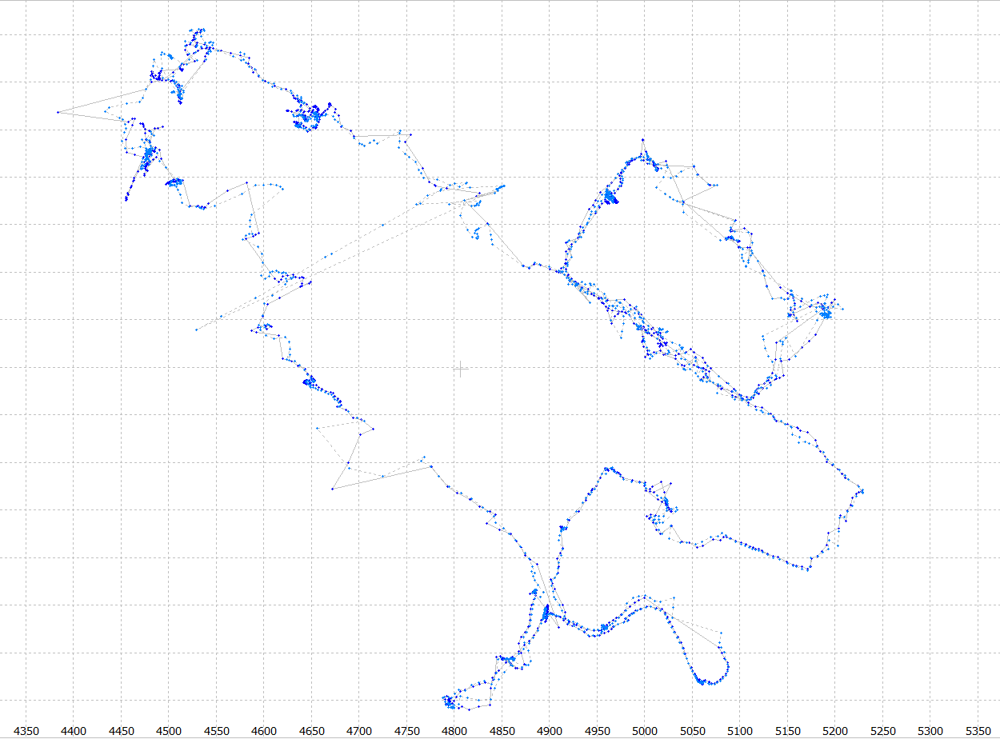
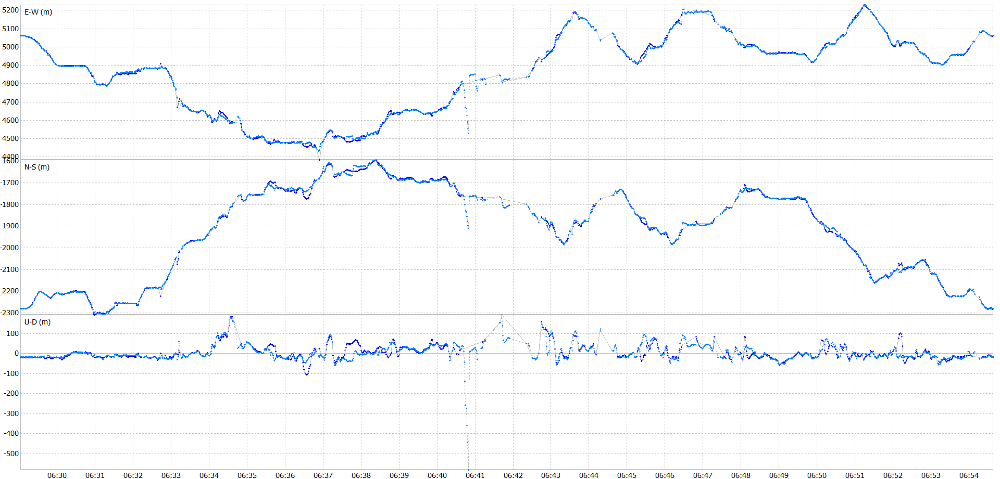

# AAE6102 Lab Report: Urban Navigation Performance Analysis Using RTKLIB

**Group Members**:  

ZHANG Yuanyuan, 23037185R;
LI Yuan, 23036326R;
MO Longfei, 23125334R;
Lyu zhen, 23132043R;
XU Ruijie, 23036234R;
MENG Qingyang, 23125921R;

**Date**: 16/4/2025 

---
## 1. Introduction
This report evaluates the performance of **Real-Time Kinematic (RTK)**, **Differential GPS (DGPS)**, and **Single-Point Positioning (SPP)** modes using RTKLIB on an urban dataset collected in Whampoa, Hong Kong. Key objectives:  
- Process raw GNSS data (`*.obs`, `*.21g/b/l`) to generate positioning solutions.  
- Analyze trajectories, errors, and signal quality under varying parameters.  
- Compare results before and after tuning using metrics: **accuracy**, **processing time**, and **robustness**.
---
## 2. Data and Tools
### Input Files
- **Observation Files**:  
  - `20210521.medium-urban.whampoa.ublox.f9p.obs` (RINEX)  
  - `UrbanNav_whampoa_raw.txt` (Receiver raw data)  
- **Broadcast Ephemeris**:  
  - `hksc141g.21g` (GPS), `hksc141g.21b` (BDS), `hksc141g.21l` (GLONASS)  

### Output Files (Generated via RTKLIB)
| Mode          | Files | Description |
|---------------|-------|-------------|
| **RTK L1**    | `.pos`, `.stat`, `_events` | RTK L1 frequency only |
| **RTK L1+L2** | `.pos`, `.stat`, `_events` |  RTK L1+L2 frequency |
| **DGPS C1**   | `.pos`, `.stat`, `_events` | Differential GPS C1 frequency |
| **DGPS C1+C2**   | `.pos`, `.stat`, `_events` | Differential GPS C1+C2 frequency |
| **SPP C1**       | `.pos`, `.stat`, `_events` | Single-Point Positioning C1 frequency |
| **SPP C1+C2**       | `.pos`, `.stat`, `_events` | Single-Point Positioning C1+C2 frequency |
### Tools
- **RTKLIB Apps**:  
  - `rtkpost.exe`: Batch processing to generate `.pos` files.  
  - `rtkplot.exe`: Visualization (trajectories, errors, skyplot).  
  - `pos2kml.exe`: Export to Google Earth.  
### Trajectory Visualization
#### Figure 1: Ground Track (DGPS C1 and DGPS C1+C2)

#### Figure 2: Ground Track (RTK L1 and RTK L1+L2)

#### Figure 3: Ground Track (SPP C1 and SPP C1+C2)

---
## 3. Methodology
### 3.1 Data Processing Pipeline
1. **Configure `rtkpost.exe`**:  
   - Input: `whampoa.obs` + `hksc141g.21g/b/l` (reference station).  
   - Output: `.pos` files for each mode (RTK/DGPS/SPP).  
   - Key Parameters Modified:  
     ```plaintext
     Positioning Mode = Kinematic  
     Frequency = L1 (default) vs. L1+L2+E5B
     Elevation Mask = 15° (default) → 10° (tuned)  
     ```
2. **Generate Plots**:  
   - Use `rtkplot.exe` to visualize:  
     - **Gnd Trk**: 2D trajectory overlay (compare modes).  
     - **Position**: Height/easting/northing errors.  
     - **Velocity/Accel**: Dynamics in urban canyon.  
### 3.2 Parameter Tuning
| Parameter         | Default | Tuned | Rationale |
|-------------------|---------|-------|-----------|
| **SNR Mask** | 0° | 30° | quality control |
| **Elevation Mask** | 15° | 40° | quality control |
| **Filter frequency** | L1+L2 | L1-only | Compare dual vs. single frequency. |
| **Filter type** | code | code + carrier phase | Compare SPP/DGNSS/RTK |

Analysis of parameter adjustments for urban areas
Signal-to-Noise and elevation angle threshold Adjustment:
Increasing the SNR threshold and elevation angle helps mitigate the effects of multipath signals, which are prevalent in urban environments due to reflections from buildings and obstacles. However，the reduced number of satellites will also compromise the spatial geometry, resulting in reduced accuracy.

#### Figure 4: The positioning results when the cut-off elevation angle is 30 degrees.


#### Figure 5: The positioning results when the cut-off SNR is 30 dB-Hz.


Measurement Type Adjustment:
Switching from a combined dual-frequency filter to an single-frequency filter allows for a focused analysis of the performance of a single-frequency system. This helps determine if a dual-frequency approach offers a significant advantage in an urban environment, or if relying on a simpler single-frequency approach is more effective.

In urban environments, carrier phase and pseudorange have significant effects on positioning accuracy. Pseudorange positioning is suitable for dynamic scenarios due to its ease of use and fast response, but it is easily affected by multipath effects and noise, and its accuracy is generally at the meter level, which cannot meet high-precision requirements. In contrast, carrier phase positioning uses phase information to achieve centimeter-level accuracy and is more resistant to interference, making it suitable for high-precision applications. However, it requires initialization and resolution of integer ambiguities, which increases the complexity of implementation.

---
## 4. Results and Analysis
### 4.1 Position Comparison Visualization
#### Figure 6: Position Comparison between DGPS L1 and DGPS L1+L2
The plot shows the positional discrepancies between single-frequency (L1) and dual-frequency (L1+L2) DGPS solutions. While both solutions show similar trends, the L1+L2 solution appears smoother and has fewer deviations. However, the results also indicate that DGPS, even with dual frequencies, struggles with multipath and signal obstructions typical of urban settings, as reflected in the noisy data. 

#### Figure 7: Position Comparison between RTK L1 and RTK LI+L2
The RTK L1+L2 solution shows noticeably higher stability and consistency compared to RTK L1, especially in the U direction. The L1-only solution exhibits greater jumps and noise, indicating reduced reliability. The RTK L1+L2 solution benefits from carrier-phase measurements on dual frequencies, which allow for better ambiguity resolution and robustness against ionospheric and tropospheric delays. This is critical in urban environments where multipath effects and signal blockages are prevalent. 

#### Figure 8: Position Comparison between SPP L1 and SPP L1+L2
The SPP L1+L2 solution provides slightly improved accuracy and smoother trends compared to SPP L1. However, both solutions exhibit significant noise and deviations, particularly in the vertical component, indicating that single-point positioning is less reliable in urban scenarios. 


### 4.2 Signal quality analysis
#### Figure 9: Signal-to-Noise Ratio (SNR) and Multipath Analysis


The chart shows the Signal-to-Noise Ratio (SNR) and multipath effects in an urban environment. SNR values fluctuate between 10 and 40 dBHz, indicating stable signal quality without a direct relationship to elevation angle. Meanwhile, the multipath effects remain minimal, ranging from -5 to 5 meters, suggesting limited impact on positioning accuracy. Overall, these findings highlight the importance of considering urban interferences in positioning analysis beyond just elevation angles.

### 4.3 Residual analysis
#### Figure 10: Code and carrier phase residual of RTK results


The RTK residuals displayed in the graph compares pseudorange and carrier-phase residuals. The pseudorange residuals exhibit significant fluctuations, with a range reaching up to 10 meters, indicating substantial impacts from multipath effects and noise, particularly in urban environments. In contrast, the carrier-phase residuals remain relatively stable, fluctuating within ±0.1 meters, showcasing their high precision. Although there are some outliers, the overall stability suggests that carrier-phase positioning outperforms pseudorange in terms of accuracy and resilience to interference. This analysis underscores the importance of prioritizing carrier-phase methods for high-precision positioning needs.


### 4.3 Error Analysis

The accuracy of various positioning methods is generally at the meter level, with RTK using dual-frequency (L1+L2) slightly outperforming DGPS/SPP in urban environments, although RTK ambiguity is challenging to resolve. Additionally, tuning SNR/elevation masks shows limited improvement, as strict thresholds can potentially reduce positioning accuracy and negatively impact geometric structure, further complicating effective positioning in dense urban settings.
